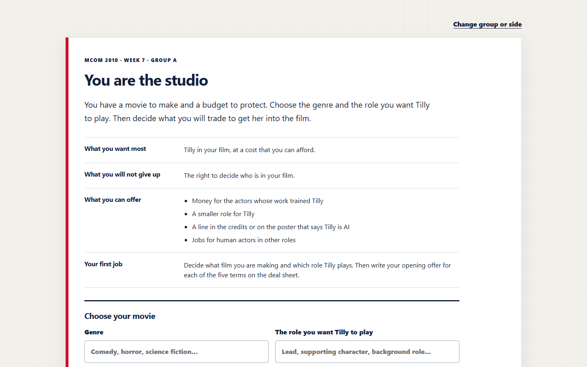
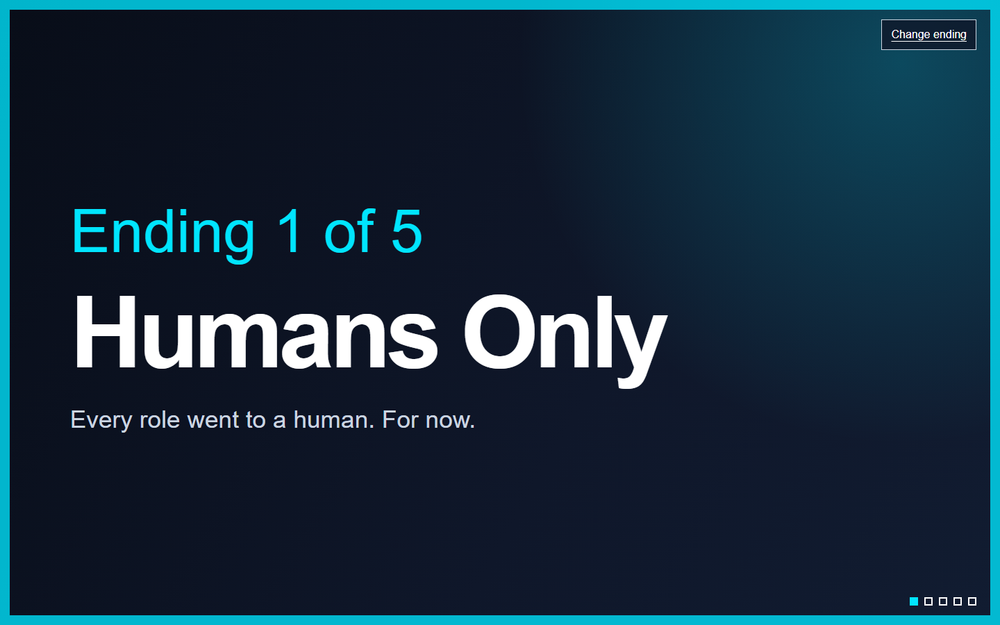

# The Tilly Deal

The Tilly Deal is a classroom live action role-playing game about AI actors, labor, consent, and disclosure. Students play three sides in a film negotiation:

- a studio that wants to cast the AI actor Tilly Norwood
- an actors' union protecting human performers
- the AI company that made Tilly

The groups negotiate five terms: role, consent, pay, credit, and telling the audience. A news flash changes the stakes midway through the game. The instructor then enters the final deal into a second app, which matches it to one of five video game style endings.





## What is in this repository

`student-deal-sheet/` is the student app. It gives each group a role card and a five-term deal sheet. Drafts stay in the browser. Submitted work goes to Supabase, and the protected instructor dashboard at `/teach` can export a CSV file.

`ending-generator/` is the instructor app. It takes the final deal and asks Anthropic to select one of five fixed endings. The model can explain the match and write a short epilogue, but it cannot invent new endings or change the rules. Without an API key, this app runs in deterministic demo mode.

`FACILITATOR_GUIDE.md` contains a 60-minute classroom plan and the news flash.

The two apps deploy separately because they use different server settings and secrets.

## Before you deploy

You need:

- a GitHub account
- a Vercel account
- a Supabase project for student submissions
- an Anthropic API key if you want model-selected endings

Every secret belongs in the deployment environment, never in the repository. The included `.env.example` files contain names and placeholders only.

## Deploy the student app

1. Create a Supabase project.
2. Open the Supabase SQL editor and run `student-deal-sheet/supabase/schema.sql`.
3. Import this repository into Vercel as a new project.
4. Set the Vercel Root Directory to `student-deal-sheet`.
5. Add these environment variables in Vercel:
   - `SUPABASE_URL`
   - `SUPABASE_SERVICE_ROLE_KEY`
   - `TEACHER_PASSWORD`
   - `TEACHER_COOKIE_SECRET`
6. Deploy. The student page is `/`; the instructor dashboard is `/teach`.

The Supabase service role key is server-only. Do not rename it with a `NEXT_PUBLIC_` prefix or place it in browser code.

## Deploy the ending generator

1. Import this repository into Vercel as another project.
2. Set the Vercel Root Directory to `ending-generator`.
3. Add:
   - `ANTHROPIC_API_KEY`
   - `TEACHER_CODE`
   - `ANTHROPIC_MODEL` if you want to override the default model
4. Deploy.

If `ANTHROPIC_API_KEY` is absent, the ending generator uses its built-in demo rules. The API key stays on the server. The app does not save or log the deal text.

## Run locally

Copy each `.env.example` to `.env.local` inside the same app directory, then replace the placeholders with your own values.

Student app:

```bash
cd student-deal-sheet
npm run check
npm test
npm run dev
```

Open `http://127.0.0.1:3000`.

Ending generator:

```bash
cd ending-generator
npm run check
npm test
npm run dev
```

Open `http://127.0.0.1:4174`. You can omit the Anthropic key to rehearse in demo mode.

## Customize it

The role cards and sources are in `student-deal-sheet/assets/role-deal-app.js`. The five endings, matching rules, questions, and model prompt are in `ending-generator/lib/core.mjs`. Change the course title and footer in each `index.html` file.

The current version uses Tilly Norwood and published reporting as a case for classroom discussion. It is an independent educational project and is not affiliated with Tilly Norwood, Particle6, SAG-AFTRA, Anthropic, Supabase, or Vercel.

## Privacy and security

- Students do not create accounts.
- The student app asks only for first names and the group's negotiation answers.
- Supabase rejects anonymous table access; server routes use the service role key.
- The instructor dashboard uses an HTTP-only signed cookie.
- The ending generator checks a teacher code and rate-limits model calls.
- API keys and teacher credentials are excluded by `.gitignore`.

Review your institution's privacy rules before collecting student work. Delete classroom submissions according to your own retention policy.

## Credits

Designed and taught by Dr. Anqi Shao for MCOM 2010: AI in Media and Communication. Coding was completed with help from Claude Opus 5.5 and GPT-5.6 Sol.

## License

MIT. See `LICENSE`.
